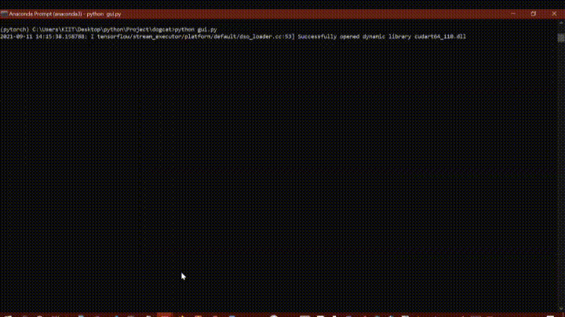

# Dog-Cat-Classification
Cats vs Dogs Classification (with 98.7% Accuracy) using CNN Keras 


Dataset Used : [Dogs-VS-Cat](https://www.kaggle.com/c/dogs-vs-cats/data)

# The Asirra (Dogs VS Cats) dataset:

The Asirra (animal species image recognition for restricting access) dataset was introduced in 2013 for a machine learning competition. The dataset includes 25,000 images with equal numbers of labels for cats and dogs.

# CNN using Keras Sequential API

A neural network in which at least one layer is a convolutional layer. A typical convolutional neural network consists of some combination of the following layers:

- convolutional layers
- pooling layers
- dense layers

# Cats VS Dogs Classifier GUI:

The GUI is bulit using Tkinter python.

## INSTALLATION

To install Tkinter :
```
sudo apt-get install python3-tk
```
## GETTING STARTED

Save the model:
```python
model.save("model1_catsVSdogs_10epoch.h5")
```

Create a new directory, copy your model (`model1_catsVSdogs_10epoch.h5`) to the same directory.

Save the `gui.py` file and run :
```python
python3 gui.py
```



[Thanks You !](https://data-flair.training/blogs/cats-dogs-classification-deep-learning-project-beginners/)
